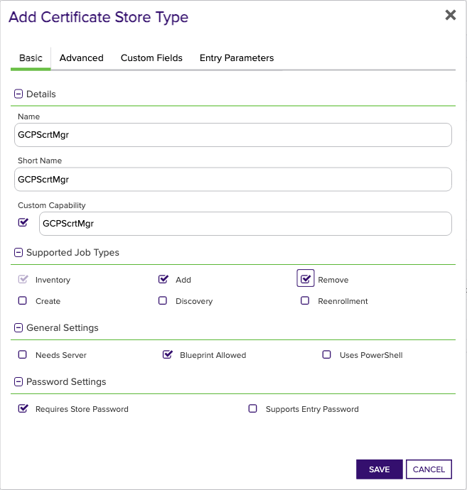
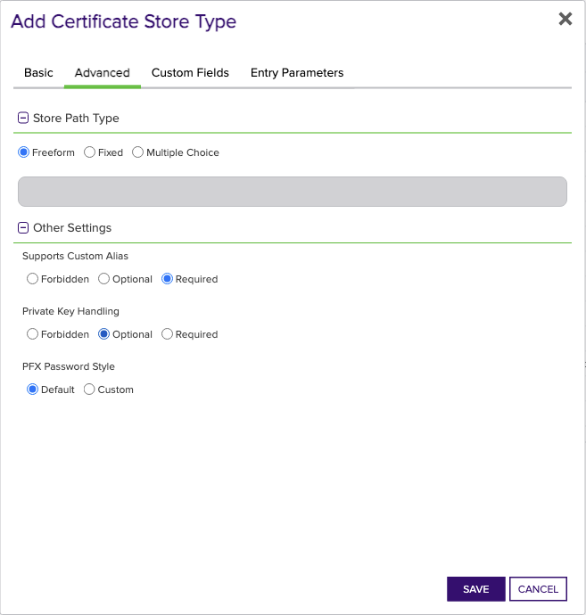
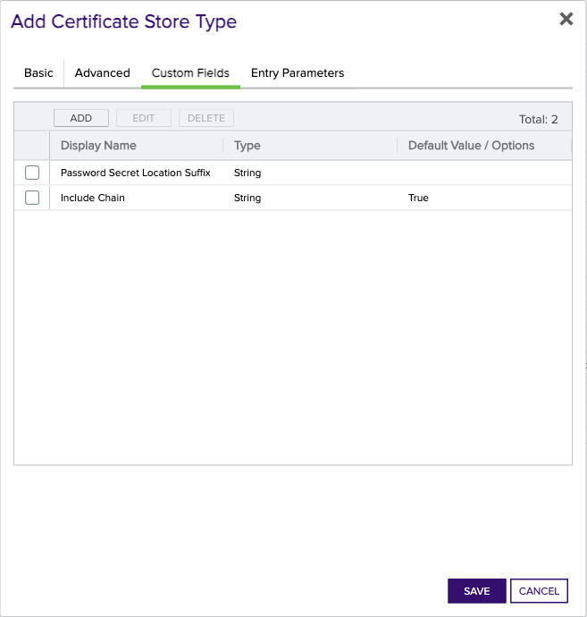

<h1 align="center" style="border-bottom: none">
    GCP Secret Manager Universal Orchestrator Extension
</h1>

<p align="center">
  <!-- Badges -->

<a href="https://github.com/Keyfactor/gcp-secretmanager-orchestrator/releases"></a>


</p>

<p align="center">
  <!-- TOC -->
  <a href="#support">
    <b>Support</b>
  </a>
  ·
  <a href="#installation">
    <b>Installation</b>
  </a>
  ·
  <a href="#license">
    <b>License</b>
  </a>
  ·
  <a href="https://github.com/orgs/Keyfactor/repositories?q=orchestrator">
    <b>Related Integrations</b>
  </a>
</p>

## Overview

The Google Cloud Platform (GCP) Secret Manager Orchestrator Extension remotely manages certificates stored as secrets in Google Cloud's Secret Manager.  Each certificate store set up in Keyfactor Command represents a Google Cloud project.  This orchestrator extension supports the inventory and management of certificates in PEM format stored as secrets and supports the following use cases:

* PEM encoded certificate and unencrypted or encrypted private key
* PEM encoded certificate and unencrypted or encrypted private key with full certificate chain
* PEM encoded certificate only

For use cases including an encrypted private key, please refer to [Certificate Encryption Details](#certificate-encryption-details) for more information on handling/storing the encryption password for the private key.


## Compatibility

This integration is compatible with Keyfactor Universal Orchestrator version 10.4 and later.

## Support
The GCP Secret Manager Universal Orchestrator extension is supported by Keyfactor for Keyfactor customers. If you have a support issue, please open a support ticket with your Keyfactor representative. If you have a support issue, please open a support ticket via the Keyfactor Support Portal at https://support.keyfactor.com. 
 
> To report a problem or suggest a new feature, use the **[Issues](../../issues)** tab. If you want to contribute actual bug fixes or proposed enhancements, use the **[Pull requests](../../pulls)** tab.

## Requirements & Prerequisites

Before installing the GCP Secret Manager Universal Orchestrator extension, we recommend that you install [kfutil](https://github.com/Keyfactor/kfutil). Kfutil is a command-line tool that simplifies the process of creating store types, installing extensions, and instantiating certificate stores in Keyfactor Command.


The GCP Secret Manager Orchestrator Extension uses Google Application Default Credentials (ADC) for authentication.  Testing of this orchestrator extension was performed using a service account, but please review [Google Application Default Credentials](https://cloud.google.com/docs/authentication/application-default-credentials) for more information on the various ways authentication can be set up.

The GCP project and account being used to access Secret Manager must have access to and enabled the Secret Manger API and also must have assigned to it the Secret Manager Admin role.


## Create the GCPScrtMgr Certificate Store Type

To use the GCP Secret Manager Universal Orchestrator extension, you **must** create the GCPScrtMgr Certificate Store Type. This only needs to happen _once_ per Keyfactor Command instance.


* **Create GCPScrtMgr using kfutil**:

    ```shell
    # GCPScrtMgr
    kfutil store-types create GCPScrtMgr
    ```

* **Create GCPScrtMgr manually in the Command UI**:
    <details><summary>Create GCPScrtMgr manually in the Command UI</summary>

    Create a store type called `GCPScrtMgr` with the attributes in the tables below:

    #### Basic Tab
    | Attribute | Value | Description |
    | --------- | ----- | ----- |
    | Name | GCPScrtMgr | Display name for the store type (may be customized) |
    | Short Name | GCPScrtMgr | Short display name for the store type |
    | Capability | GCPScrtMgr | Store type name orchestrator will register with. Check the box to allow entry of value |
    | Supports Add | ✅ Checked | Check the box. Indicates that the Store Type supports Management Add |
    | Supports Remove | ✅ Checked | Check the box. Indicates that the Store Type supports Management Remove |
    | Supports Discovery | 🔲 Unchecked |  Indicates that the Store Type supports Discovery |
    | Supports Reenrollment | 🔲 Unchecked |  Indicates that the Store Type supports Reenrollment |
    | Supports Create | 🔲 Unchecked |  Indicates that the Store Type supports store creation |
    | Needs Server | 🔲 Unchecked | Determines if a target server name is required when creating store |
    | Blueprint Allowed | ✅ Checked | Determines if store type may be included in an Orchestrator blueprint |
    | Uses PowerShell | 🔲 Unchecked | Determines if underlying implementation is PowerShell |
    | Requires Store Password | ✅ Checked | Enables users to optionally specify a store password when defining a Certificate Store. |
    | Supports Entry Password | 🔲 Unchecked | Determines if an individual entry within a store can have a password. |

    The Basic tab should look like this:

    

    #### Advanced Tab
    | Attribute | Value | Description |
    | --------- | ----- | ----- |
    | Supports Custom Alias | Required | Determines if an individual entry within a store can have a custom Alias. |
    | Private Key Handling | Optional | This determines if Keyfactor can send the private key associated with a certificate to the store. Required because IIS certificates without private keys would be invalid. |
    | PFX Password Style | Default | 'Default' - PFX password is randomly generated, 'Custom' - PFX password may be specified when the enrollment job is created (Requires the Allow Custom Password application setting to be enabled.) |

    The Advanced tab should look like this:

    

    #### Custom Fields Tab
    Custom fields operate at the certificate store level and are used to control how the orchestrator connects to the remote target server containing the certificate store to be managed. The following custom fields should be added to the store type:

    | Name | Display Name | Description | Type | Default Value/Options | Required |
    | ---- | ------------ | ---- | --------------------- | -------- | ----------- |
    | PasswordSecretSuffix | Password Secret Location Suffix | If storing a certificate with an encrypted private key, this is the suffix to add to the certificate (secret) alias name where the encrypted private key password will be stored.  Please see [Certificate Encryption Details](#certificate-encryption-details) for more information | String |  | 🔲 Unchecked |
    | IncludeChain | Include Chain | Determines whether to include the certificate chain when adding a certificate as a secret. | Bool | True | 🔲 Unchecked |

    The Custom Fields tab should look like this:

    


    </details>

## Installation

1. **Download the latest GCP Secret Manager Universal Orchestrator extension from GitHub.** 

    Navigate to the [GCP Secret Manager Universal Orchestrator extension GitHub version page](https://github.com/Keyfactor/gcp-secretmanager-orchestrator/releases/latest). Refer to the compatibility matrix below to determine whether the `net6.0` or `net8.0` asset should be downloaded. Then, click the corresponding asset to download the zip archive.
    | Universal Orchestrator Version | Latest .NET version installed on the Universal Orchestrator server | `rollForward` condition in `Orchestrator.runtimeconfig.json` | `gcp-secretmanager-orchestrator` .NET version to download |
    | --------- | ----------- | ----------- | ----------- |
    | Older than `11.0.0` | | | `net6.0` |
    | Between `11.0.0` and `11.5.1` (inclusive) | `net6.0` | | `net6.0` | 
    | Between `11.0.0` and `11.5.1` (inclusive) | `net8.0` | `Disable` | `net6.0` | 
    | Between `11.0.0` and `11.5.1` (inclusive) | `net8.0` | `LatestMajor` | `net8.0` | 
    | `11.6` _and_ newer | `net8.0` | | `net8.0` |

    Unzip the archive containing extension assemblies to a known location.

    > **Note** If you don't see an asset with a corresponding .NET version, you should always assume that it was compiled for `net6.0`.

2. **Locate the Universal Orchestrator extensions directory.**

    * **Default on Windows** - `C:\Program Files\Keyfactor\Keyfactor Orchestrator\extensions`
    * **Default on Linux** - `/opt/keyfactor/orchestrator/extensions`
    
3. **Create a new directory for the GCP Secret Manager Universal Orchestrator extension inside the extensions directory.**
        
    Create a new directory called `gcp-secretmanager-orchestrator`.
    > The directory name does not need to match any names used elsewhere; it just has to be unique within the extensions directory.

4. **Copy the contents of the downloaded and unzipped assemblies from __step 2__ to the `gcp-secretmanager-orchestrator` directory.**

5. **Restart the Universal Orchestrator service.**

    Refer to [Starting/Restarting the Universal Orchestrator service](https://software.keyfactor.com/Core-OnPrem/Current/Content/InstallingAgents/NetCoreOrchestrator/StarttheService.htm).


6. **(optional) PAM Integration** 

    The GCP Secret Manager Universal Orchestrator extension is compatible with all supported Keyfactor PAM extensions to resolve PAM-eligible secrets. PAM extensions running on Universal Orchestrators enable secure retrieval of secrets from a connected PAM provider.

    To configure a PAM provider, [reference the Keyfactor Integration Catalog](https://keyfactor.github.io/integrations-catalog/content/pam) to select an extension, and follow the associated instructions to install it on the Universal Orchestrator (remote).


> The above installation steps can be supplimented by the [official Command documentation](https://software.keyfactor.com/Core-OnPrem/Current/Content/InstallingAgents/NetCoreOrchestrator/CustomExtensions.htm?Highlight=extensions).


## Defining Certificate Stores


* **Manually with the Command UI**

    <details><summary>Create Certificate Stores manually in the UI</summary>

    1. **Navigate to the _Certificate Stores_ page in Keyfactor Command.**

        Log into Keyfactor Command, toggle the _Locations_ dropdown, and click _Certificate Stores_.

    2. **Add a Certificate Store.**

        Click the Add button to add a new Certificate Store. Use the table below to populate the **Attributes** in the **Add** form.
        | Attribute | Description |
        | --------- | ----------- |
        | Category | Select "GCPScrtMgr" or the customized certificate store name from the previous step. |
        | Container | Optional container to associate certificate store with. |
        | Client Machine | Not used |
        | Store Path | The Project ID of the Google Secret Manager being managed. |
        | Orchestrator | Select an approved orchestrator capable of managing `GCPScrtMgr` certificates. Specifically, one with the `GCPScrtMgr` capability. |
        | PasswordSecretSuffix | If storing a certificate with an encrypted private key, this is the suffix to add to the certificate (secret) alias name where the encrypted private key password will be stored.  Please see [Certificate Encryption Details](#certificate-encryption-details) for more information |
        | IncludeChain | Determines whether to include the certificate chain when adding a certificate as a secret. |
        | Store Password | Password used to encrypt the private key of ALL certificate secrets.  Please see [Certificate Encryption Details](#certificate-encryption-details) for more information |

        

        <details><summary>Attributes eligible for retrieval by a PAM Provider on the Universal Orchestrator</summary>

        If a PAM provider was installed _on the Universal Orchestrator_ in the [Installation](#Installation) section, the following parameters can be configured for retrieval _on the Universal Orchestrator_.
        | Attribute | Description |
        | --------- | ----------- |
        | Store Password | Password used to encrypt the private key of ALL certificate secrets.  Please see [Certificate Encryption Details](#certificate-encryption-details) for more information |

        Please refer to the **Universal Orchestrator (remote)** usage section ([PAM providers on the Keyfactor Integration Catalog](https://keyfactor.github.io/integrations-catalog/content/pam)) for your selected PAM provider for instructions on how to load attributes orchestrator-side.

        > Any secret can be rendered by a PAM provider _installed on the Keyfactor Command server_. The above parameters are specific to attributes that can be fetched by an installed PAM provider running on the Universal Orchestrator server itself. 
        </details>
        

    </details>

* **Using kfutil**
    
    <details><summary>Create Certificate Stores with kfutil</summary>
    
    1. **Generate a CSV template for the GCPScrtMgr certificate store**

        ```shell
        kfutil stores import generate-template --store-type-name GCPScrtMgr --outpath GCPScrtMgr.csv
        ```
    2. **Populate the generated CSV file**

        Open the CSV file, and reference the table below to populate parameters for each **Attribute**.
        | Attribute | Description |
        | --------- | ----------- |
        | Category | Select "GCPScrtMgr" or the customized certificate store name from the previous step. |
        | Container | Optional container to associate certificate store with. |
        | Client Machine | Not used |
        | Store Path | The Project ID of the Google Secret Manager being managed. |
        | Orchestrator | Select an approved orchestrator capable of managing `GCPScrtMgr` certificates. Specifically, one with the `GCPScrtMgr` capability. |
        | PasswordSecretSuffix | If storing a certificate with an encrypted private key, this is the suffix to add to the certificate (secret) alias name where the encrypted private key password will be stored.  Please see [Certificate Encryption Details](#certificate-encryption-details) for more information |
        | IncludeChain | Determines whether to include the certificate chain when adding a certificate as a secret. |
        | Store Password | Password used to encrypt the private key of ALL certificate secrets.  Please see [Certificate Encryption Details](#certificate-encryption-details) for more information |

        

        <details><summary>Attributes eligible for retrieval by a PAM Provider on the Universal Orchestrator</summary>

        If a PAM provider was installed _on the Universal Orchestrator_ in the [Installation](#Installation) section, the following parameters can be configured for retrieval _on the Universal Orchestrator_.
        | Attribute | Description |
        | --------- | ----------- |
        | Store Password | Password used to encrypt the private key of ALL certificate secrets.  Please see [Certificate Encryption Details](#certificate-encryption-details) for more information |

        > Any secret can be rendered by a PAM provider _installed on the Keyfactor Command server_. The above parameters are specific to attributes that can be fetched by an installed PAM provider running on the Universal Orchestrator server itself. 
        </details>
        

    3. **Import the CSV file to create the certificate stores** 

        ```shell
        kfutil stores import csv --store-type-name GCPScrtMgr --file GCPScrtMgr.csv
        ```
    </details>

> The content in this section can be supplimented by the [official Command documentation](https://software.keyfactor.com/Core-OnPrem/Current/Content/ReferenceGuide/Certificate%20Stores.htm?Highlight=certificate%20store).


## Certificate Encryption Details

For GCP Secret Manager secrets containing private keys, the GCP Secret Manager Orchestrator Extension provides three ways to manage the certificate private key:

1. Using the Keyfactor Command Store Password on the certificate store definition to store the password that will be used to encrypt ALL private keys for the GCP Secret Manager project.
2. Using the Password Secret Location Suffix field on the certificate store definition to store a "suffix" that will be used in conjunction with the secret alias (name) to create a second secret in Secret Manager to store the encryption password.
3. If no Store Password is set and the Password Secret Location Suffix is either missing or blank, the private key will not be encrypted.

If the Store Password has a value, this will be used to encrypt the private key during a Management Add job.  If no value is set for the Store Password, the one time password that Keyfactor Command generates when triggering a Management-Add job will be used to encrypt the private key and this password will be stored as a secret in GCP Secret Manager with a name of Alias + Password Secret Location Suffix.  For example, if the certificate alias is set as "Alias1" and the Password Secret Location Suffix is set as "_Key", the certificate and encrypted private key will be stored in a secret named "Alias1" and the password for the key encryption will be stored in a secret named "Alias1_Key".  Please note that if using the generated password Keyfactor Command provides and storing the password in Secret Manager, each renewal/replacement of a certificate will encrypt the private key with a new generated password, which will then be stored as a new version of the password secret.


## License

Apache License 2.0, see [LICENSE](LICENSE).

## Related Integrations

See all [Keyfactor Universal Orchestrator extensions](https://github.com/orgs/Keyfactor/repositories?q=orchestrator).