<h1 align="center" style="border-bottom: none">
    GCP Secret Manager Universal Orchestrator Extension
</h1>

<p align="center">
  <!-- Badges -->

<a href="https://github.com/Keyfactor/gcp-secretmanager-orchestrator/releases"></a>


</p>

<p align="center">
  <!-- TOC -->
  <a href="#support">
    <b>Support</b>
  </a>
  ·
  <a href="#installation">
    <b>Installation</b>
  </a>
  ·
  <a href="#license">
    <b>License</b>
  </a>
  ·
  <a href="https://github.com/orgs/Keyfactor/repositories?q=orchestrator">
    <b>Related Integrations</b>
  </a>
</p>

## Overview

The Google Cloud Platform (GCP) Secret Manager Orchestrator Extension remotely manages certificates stored as secrets in Google Cloud's Secret Manager.  Each certificate store set up in Keyfactor Command represents a Google Cloud project.  This orchestrator extension supports the inventory and management of certificates in PEM format stored as secrets and supports the following use cases:

* PEM encoded certificate and unencrypted or encrypted private key
* PEM encoded certificate and unencrypted or encrypted private key with full certificate chain
* PEM encoded certificate only

Additional features:
* For use cases including an encrypted private key, please refer to [Certificate Encryption Details](#certificate-encryption-details) for more information on handling/storing the encryption password for the private key.
* For information on Tag Support, please refer to [Tag Support](#tag-support)
* For information on Label Support, please refer to [Label Support](#label-support)
* For information on Automatic vs User Managed Replication, please refer to [Region Replication](#region-replication)
* For information on Secret and Secret Version Retention, please refer to [TTL and TTL Version Retention](#ttl-and-ttl-version-retention)

## Compatibility

This integration is compatible with Keyfactor Universal Orchestrator version 10.4 and later.

## Support

The GCP Secret Manager Universal Orchestrator extension is supported by Keyfactor. If you require support for any issues or have feature request, please open a support ticket by either contacting your Keyfactor representative or via the Keyfactor Support Portal at https://support.keyfactor.com.

> If you want to contribute bug fixes or additional enhancements, use the **[Pull requests](../../pulls)** tab.

## Requirements & Prerequisites

Before installing the GCP Secret Manager Universal Orchestrator extension, we recommend that you install [kfutil](https://github.com/Keyfactor/kfutil). Kfutil is a command-line tool that simplifies the process of creating store types, installing extensions, and instantiating certificate stores in Keyfactor Command.

The GCP Secret Manager Orchestrator Extension uses Google Application Default Credentials (ADC) for authentication.  Testing of this orchestrator extension was performed using a service account, but please review [Google Application Default Credentials](https://cloud.google.com/docs/authentication/application-default-credentials) for more information on the various ways authentication can be set up.

The GCP project and account being used to access Secret Manager must have access to and enabled the Secret Manger API and also must have assigned to it the following roles:
* Secret Manager Admin
* Tag User (if assigning tags to secrets)
* Folder Viewer (if assigning tags to secrets AND the project assigned for this certificate store has a folder as a direct parent)
* Cloud KMS CryptoKey Encrypter/Decrypter (If assigning KMS Paths to regions when adding secrets using user managed replication)

## GCPScrtMgr Certificate Store Type

To use the GCP Secret Manager Universal Orchestrator extension, you **must** create the GCPScrtMgr Certificate Store Type. This only needs to happen _once_ per Keyfactor Command instance.


#### Supported Operations

| Operation    | Is Supported |
|--------------|--------------|
| Add          | ✅ Checked |
| Remove       | ✅ Checked |
| Discovery    | 🔲 Unchecked |
| Reenrollment | 🔲 Unchecked |
| Create       | 🔲 Unchecked |

#### Store Type Creation

##### Using kfutil:
`kfutil` is a custom CLI for the Keyfactor Command API and can be used to create certificate store types.
For more information on [kfutil](https://github.com/Keyfactor/kfutil) check out the [docs](https://github.com/Keyfactor/kfutil?tab=readme-ov-file#quickstart)

   <details><summary>Click to expand GCPScrtMgr kfutil details</summary>

   ##### Using online definition from GitHub:
   This will reach out to GitHub and pull the latest store-type definition
   ```shell
   # GCPScrtMgr
   kfutil store-types create GCPScrtMgr
   ```

   ##### Offline creation using integration-manifest file:
   If required, it is possible to create store types from the [integration-manifest.json](./integration-manifest.json) included in this repo.
   You would first download the [integration-manifest.json](./integration-manifest.json) and then run the following command
   in your offline environment.
   ```shell
   kfutil store-types create --from-file integration-manifest.json
   ```
   </details>

#### Manual Creation
Below are instructions on how to create the GCPScrtMgr store type manually in
the Keyfactor Command Portal

   <details><summary>Click to expand manual GCPScrtMgr details</summary>

   Create a store type called `GCPScrtMgr` with the attributes in the tables below:

   ##### Basic Tab
   | Attribute | Value | Description |
   | --------- | ----- | ----- |
   | Name | GCPScrtMgr | Display name for the store type (may be customized) |
   | Short Name | GCPScrtMgr | Short display name for the store type |
   | Capability | GCPScrtMgr | Store type name orchestrator will register with. Check the box to allow entry of value |
   | Supports Add | ✅ Checked | Indicates that the Store Type supports Management Add |
   | Supports Remove | ✅ Checked | Indicates that the Store Type supports Management Remove |
   | Supports Discovery | 🔲 Unchecked | Indicates that the Store Type supports Discovery |
   | Supports Reenrollment | 🔲 Unchecked | Indicates that the Store Type supports Reenrollment |
   | Supports Create | 🔲 Unchecked | Indicates that the Store Type supports store creation |
   | Needs Server | 🔲 Unchecked | Determines if a target server name is required when creating store |
   | Blueprint Allowed | ✅ Checked | Determines if store type may be included in an Orchestrator blueprint |
   | Uses PowerShell | 🔲 Unchecked | Determines if underlying implementation is PowerShell |
   | Requires Store Password | ✅ Checked | Enables users to optionally specify a store password when defining a Certificate Store. |
   | Supports Entry Password | 🔲 Unchecked | Determines if an individual entry within a store can have a password. |

   The Basic tab should look like this:

   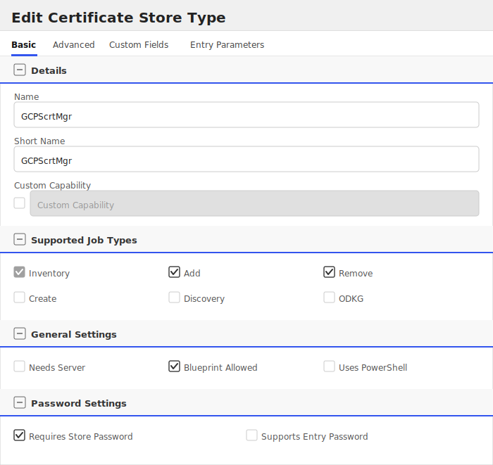

   ##### Advanced Tab
   | Attribute | Value | Description |
   | --------- | ----- | ----- |
   | Supports Custom Alias | Required | Determines if an individual entry within a store can have a custom Alias. |
   | Private Key Handling | Optional | This determines if Keyfactor can send the private key associated with a certificate to the store. |
   | PFX Password Style | Default | 'Default' - PFX password is randomly generated, 'Custom' - PFX password may be specified when the enrollment job is created (Requires the Allow Custom Password application setting to be enabled.) |

   The Advanced tab should look like this:

   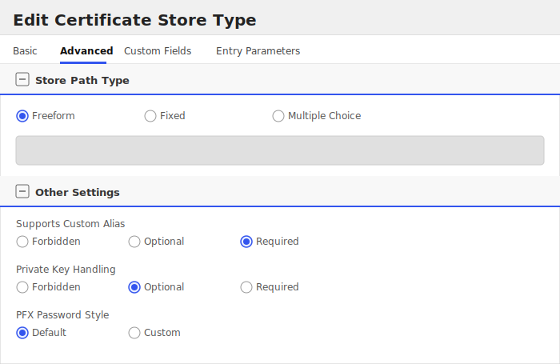

   > For Keyfactor **Command versions 24.4 and later**, a Certificate Format dropdown is available with PFX and PEM options. Ensure that **PFX** is selected, as this determines the format of new and renewed certificates sent to the Orchestrator during a Management job. Currently, all Keyfactor-supported Orchestrator extensions support only PFX.

   ##### Custom Fields Tab
   Custom fields operate at the certificate store level and are used to control how the orchestrator connects to the remote target server containing the certificate store to be managed. The following custom fields should be added to the store type:

   | Name | Display Name | Description | Type | Default Value/Options | Required |
   | ---- | ------------ | ---- | --------------------- | -------- | ----------- |
   | PasswordSecretSuffix | Password Secret Location Suffix | If storing a certificate with an encrypted private key, this is the suffix to add to the certificate (secret) alias name where the encrypted private key password will be stored.  Please see [Certificate Encryption Details](#certificate-encryption-details) for more information | String |  | 🔲 Unchecked |
   | IncludeChain | Include Chain | Determines whether to include the certificate chain when adding a certificate as a secret. | Bool | True | 🔲 Unchecked |

   The Custom Fields tab should look like this:

   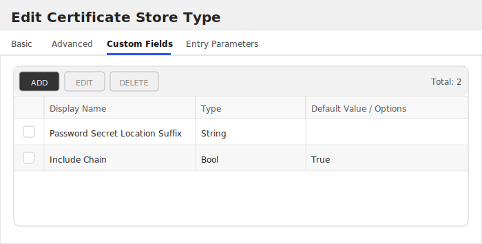

   ###### Password Secret Location Suffix
   If storing a certificate with an encrypted private key, this is the suffix to add to the certificate (secret) alias name where the encrypted private key password will be stored.  Please see [Certificate Encryption Details](#certificate-encryption-details) for more information

   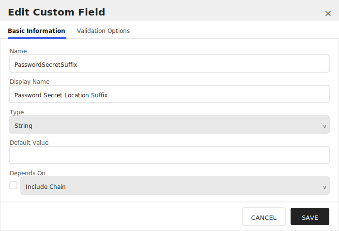
   


   ###### Include Chain
   Determines whether to include the certificate chain when adding a certificate as a secret.

   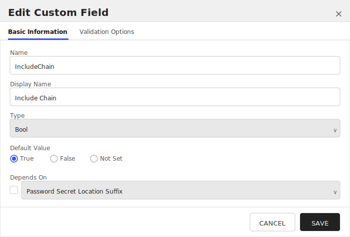
   


   ##### Entry Parameters Tab

   | Name | Display Name | Description | Type | Default Value | Entry has a private key | Adding an entry | Removing an entry | Reenrolling an entry |
   | ---- | ------------ | ---- | ------------- | ----------------------- | ---------------- | ----------------- | ------------------- | ----------- |
   | tags | Tags | An optional list of one-to-many comma delimited Organization level tag Key:Value combinations.  Values should be entered as tagKey1:tagVal1,tagKey2:tagVal2,...tagKeyN:tagValN | String |  | 🔲 Unchecked | 🔲 Unchecked | 🔲 Unchecked | 🔲 Unchecked |
   | labels | Labels | An optional list of one-to-many comma delimited label key:value pairs to assign to the secret.  Values should be entered as key1:value1,key2:value2,...,keyN:valueN. | String |  | 🔲 Unchecked | 🔲 Unchecked | 🔲 Unchecked | 🔲 Unchecked |
   | replicationRegions | Replication Regions | An optional list of valid comma delimited GCP regions to replicate secrets to (user managed replication).  If left blank, GCP default behavior (automatic replication) will be executed.  Values can also be entered as region1:path1,region2:path2,...,regionN:pathN if providing a kmsKeyName path for each region is desired. | String |  | 🔲 Unchecked | 🔲 Unchecked | 🔲 Unchecked | 🔲 Unchecked |
   | ttlDuration | TTL Duration | An optional number of days to provide after which a secret will be deleted.  If not provided, secret will stay around until explicitly deleted. | String |  | 🔲 Unchecked | 🔲 Unchecked | 🔲 Unchecked | 🔲 Unchecked |
   | versionDestroyTtlDuration | Version Destroy TTL Duration | An optional number of days to provide after a secret is destroyed that its versions will stay around.  If not provided, versions will be permanently destroyed when the secret is destroyed. | String |  | 🔲 Unchecked | 🔲 Unchecked | 🔲 Unchecked | 🔲 Unchecked |

   The Entry Parameters tab should look like this:

   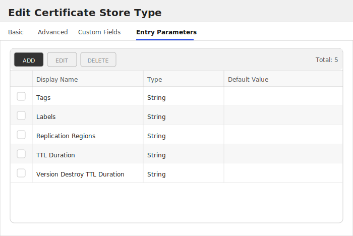
   ##### Tags
   An optional list of one-to-many comma delimited Organization level tag Key:Value combinations.  Values should be entered as tagKey1:tagVal1,tagKey2:tagVal2,...tagKeyN:tagValN

   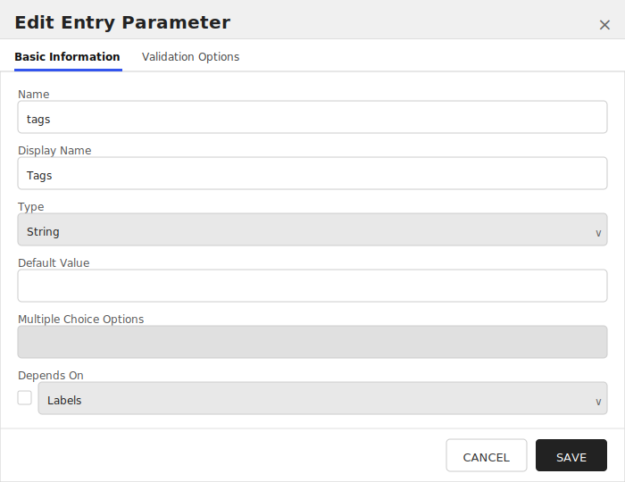
   


   ##### Labels
   An optional list of one-to-many comma delimited label key:value pairs to assign to the secret.  Values should be entered as key1:value1,key2:value2,...,keyN:valueN.

   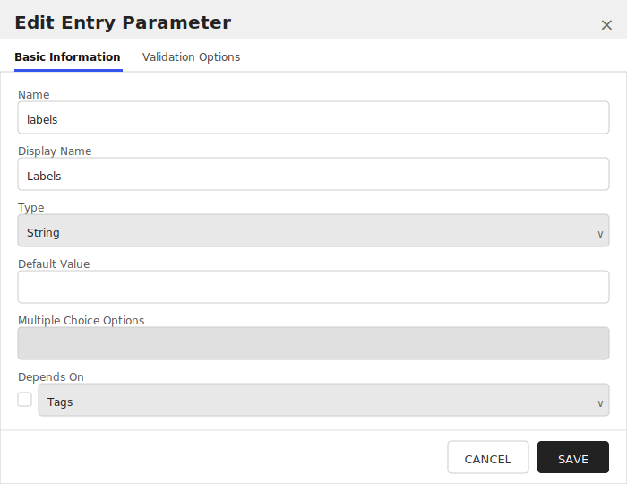
   


   ##### Replication Regions
   An optional list of valid comma delimited GCP regions to replicate secrets to (user managed replication).  If left blank, GCP default behavior (automatic replication) will be executed.  Values can also be entered as region1:path1,region2:path2,...,regionN:pathN if providing a kmsKeyName path for each region is desired.

   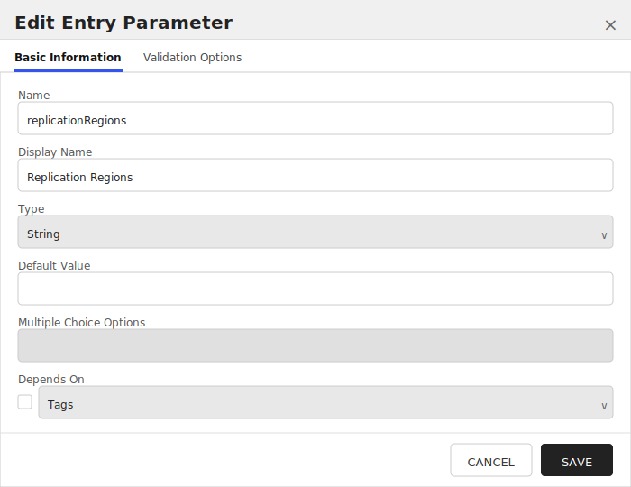
   


   ##### TTL Duration
   An optional number of days to provide after which a secret will be deleted.  If not provided, secret will stay around until explicitly deleted.

   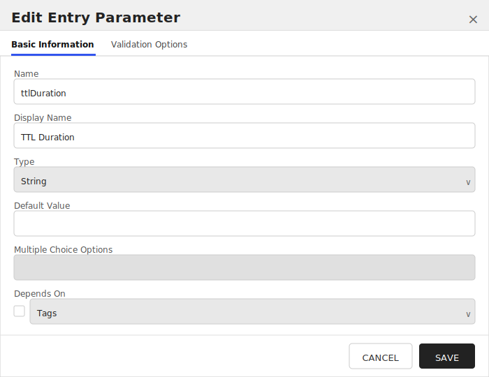
   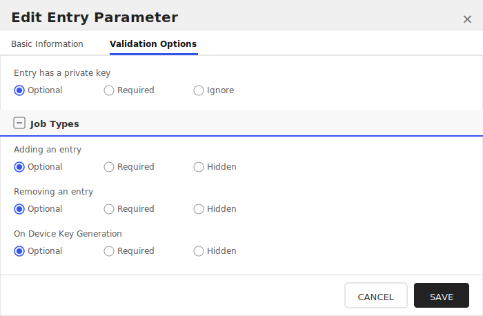


   ##### Version Destroy TTL Duration
   An optional number of days to provide after a secret is destroyed that its versions will stay around.  If not provided, versions will be permanently destroyed when the secret is destroyed.

   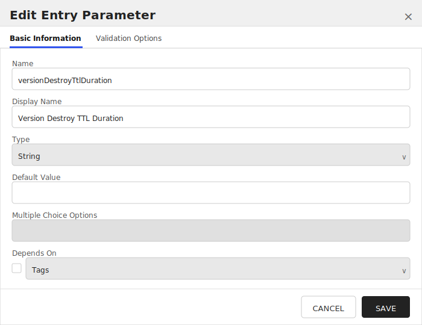
   


   </details>

## Installation

1. **Download the latest GCP Secret Manager Universal Orchestrator extension from GitHub.**

    Navigate to the [GCP Secret Manager Universal Orchestrator extension GitHub version page](https://github.com/Keyfactor/gcp-secretmanager-orchestrator/releases/latest). Refer to the compatibility matrix below to determine which asset should be downloaded. Then, click the corresponding asset to download the zip archive.

   | Universal Orchestrator Version | Latest .NET version installed on the Universal Orchestrator server | `rollForward` condition in `Orchestrator.runtimeconfig.json` | `gcp-secretmanager-orchestrator` .NET version to download |
   | --------- | ----------- | ----------- | ----------- |
   | Between `11.0.0` and `11.5.1` (inclusive) | `net8.0` | `LatestMajor` | `net8.0` |
   | Between `11.6.0` and `24.x` | `net8.0` | | `net8.0` |
   | `25.0` _and_ newer | `net10.0` | | `net10.0` |

    Unzip the archive containing extension assemblies to a known location.

    > **Note** If you don't see an asset with a corresponding .NET version, you should always assume that it was compiled for `net10.0`.

2. **Locate the Universal Orchestrator extensions directory.**

    * **Default on Windows** - `C:\Program Files\Keyfactor\Keyfactor Orchestrator\extensions`
    * **Default on Linux** - `/opt/keyfactor/orchestrator/extensions`

3. **Create a new directory for the GCP Secret Manager Universal Orchestrator extension inside the extensions directory.**

    Create a new directory called `gcp-secretmanager-orchestrator`.
    > The directory name does not need to match any names used elsewhere; it just has to be unique within the extensions directory.

4. **Copy the contents of the downloaded and unzipped assemblies from __step 2__ to the `gcp-secretmanager-orchestrator` directory.**

5. **Restart the Universal Orchestrator service.**

    Refer to [Starting/Restarting the Universal Orchestrator service](https://software.keyfactor.com/Core-OnPrem/Current/Content/InstallingAgents/NetCoreOrchestrator/StarttheService.htm).

6. **(optional) PAM Integration**

    The GCP Secret Manager Universal Orchestrator extension is compatible with all supported Keyfactor PAM extensions to resolve PAM-eligible secrets. PAM extensions running on Universal Orchestrators enable secure retrieval of secrets from a connected PAM provider.

    To configure a PAM provider, [reference the Keyfactor Integration Catalog](https://keyfactor.github.io/integrations-catalog/content/pam) to select an extension and follow the associated instructions to install it on the Universal Orchestrator (remote).

> The above installation steps can be supplemented by the [official Command documentation](https://software.keyfactor.com/Core-OnPrem/Current/Content/InstallingAgents/NetCoreOrchestrator/CustomExtensions.htm?Highlight=extensions).

## Defining Certificate Stores

### Store Creation

#### Manually with the Command UI

<details><summary>Click to expand details</summary>

1. **Navigate to the _Certificate Stores_ page in Keyfactor Command.**

    Log into Keyfactor Command, toggle the _Locations_ dropdown, and click _Certificate Stores_.

2. **Add a Certificate Store.**

    Click the Add button to add a new Certificate Store. Use the table below to populate the **Attributes** in the **Add** form.

   | Attribute | Description |
   | --------- | ----------- |
   | Category | Select "GCPScrtMgr" or the customized certificate store name from the previous step. |
   | Container | Optional container to associate certificate store with. |
   | Client Machine | Not used |
   | Store Path | The Project ID of the Google Secret Manager being managed. |
   | Store Password | Password used to encrypt the private key of ALL certificate secrets.  Please see [Certificate Encryption Details](#certificate-encryption-details) for more information |
   | Orchestrator | Select an approved orchestrator capable of managing `GCPScrtMgr` certificates. Specifically, one with the `GCPScrtMgr` capability. |
   | PasswordSecretSuffix | If storing a certificate with an encrypted private key, this is the suffix to add to the certificate (secret) alias name where the encrypted private key password will be stored.  Please see [Certificate Encryption Details](#certificate-encryption-details) for more information |
   | IncludeChain | Determines whether to include the certificate chain when adding a certificate as a secret. |

</details>

#### Using kfutil CLI

<details><summary>Click to expand details</summary>

1. **Generate a CSV template for the GCPScrtMgr certificate store**

    ```shell
    kfutil stores import generate-template --store-type-name GCPScrtMgr --outpath GCPScrtMgr.csv
    ```
2. **Populate the generated CSV file**

    Open the CSV file, and reference the table below to populate parameters for each **Attribute**.

   | Attribute | Description |
   | --------- | ----------- |
   | Category | Select "GCPScrtMgr" or the customized certificate store name from the previous step. |
   | Container | Optional container to associate certificate store with. |
   | Client Machine | Not used |
   | Store Path | The Project ID of the Google Secret Manager being managed. |
   | Store Password | Password used to encrypt the private key of ALL certificate secrets.  Please see [Certificate Encryption Details](#certificate-encryption-details) for more information |
   | Orchestrator | Select an approved orchestrator capable of managing `GCPScrtMgr` certificates. Specifically, one with the `GCPScrtMgr` capability. |
   | Properties.PasswordSecretSuffix | If storing a certificate with an encrypted private key, this is the suffix to add to the certificate (secret) alias name where the encrypted private key password will be stored.  Please see [Certificate Encryption Details](#certificate-encryption-details) for more information |
   | Properties.IncludeChain | Determines whether to include the certificate chain when adding a certificate as a secret. |

3. **Import the CSV file to create the certificate stores**

    ```shell
    kfutil stores import csv --store-type-name GCPScrtMgr --file GCPScrtMgr.csv
    ```

</details>

#### PAM Provider Eligible Fields
<details><summary>Attributes eligible for retrieval by a PAM Provider on the Universal Orchestrator</summary>

If a PAM provider was installed _on the Universal Orchestrator_ in the [Installation](#Installation) section, the following parameters can be configured for retrieval _on the Universal Orchestrator_.

   | Attribute | Description |
   | --------- | ----------- |
   | StorePassword | Password to use when reading/writing to store |

Please refer to the **Universal Orchestrator (remote)** usage section ([PAM providers on the Keyfactor Integration Catalog](https://keyfactor.github.io/integrations-catalog/content/pam)) for your selected PAM provider for instructions on how to load attributes orchestrator-side.
> Any secret can be rendered by a PAM provider _installed on the Keyfactor Command server_. The above parameters are specific to attributes that can be fetched by an installed PAM provider running on the Universal Orchestrator server itself.

</details>

> The content in this section can be supplemented by the [official Command documentation](https://software.keyfactor.com/Core-OnPrem/Current/Content/ReferenceGuide/Certificate%20Stores.htm?Highlight=certificate%20store).


## Certificate Encryption Details

For GCP Secret Manager secrets containing private keys, the GCP Secret Manager Orchestrator Extension provides three ways to manage the certificate private key:

1. Using the Keyfactor Command Store Password on the certificate store definition to store the password that will be used to encrypt ALL private keys for the GCP Secret Manager project.
2. Using the Password Secret Location Suffix field on the certificate store definition to store a "suffix" that will be used in conjunction with the secret alias (name) to create a second secret in Secret Manager to store the encryption password.
3. If no Store Password is set and the Password Secret Location Suffix is either missing or blank, the private key will not be encrypted.

If the Store Password has a value, this will be used to encrypt the private key during a Management Add job.  If no value is set for the Store Password, the one time password that Keyfactor Command generates when triggering a Management-Add job will be used to encrypt the private key and this password will be stored as a secret in GCP Secret Manager with a name of Alias + Password Secret Location Suffix.  For example, if the certificate alias is set as "Alias1" and the Password Secret Location Suffix is set as "_Key", the certificate and encrypted private key will be stored in a secret named "Alias1" and the password for the key encryption will be stored in a secret named "Alias1_Key".  Please note that if using the generated password Keyfactor Command provides and storing the password in Secret Manager, each renewal/replacement of a certificate will encrypt the private key with a new generated password, which will then be stored as a new version of the password secret.

## Tag Support

This extension supports the management of secret tags.  **If** the optional Entry Parameter "Tags" exists in the store type definition:
* Inventory will return all tags assigned to a secret in the comma delimited format of "TagKey1:TagValue1,TagKey2:TagValue2,...,TagKeyN:TagValueN".  
* The same format of one-to-many tag key/value pairs ("TagKey1:TagValue1,TagKey2:TagValue2,...,TagKeyN:TagValueN") can be added to the "Tags" field during the setup of Management-Add jobs to assign tags to the secret **as long as each tag key/value pair is already set up as a valid Organization level tag key/value combination in GCP**.

Additional notes regarding tags:
* This integration does **not** support Project level tags when adding new certificates (secrets).  Only Organization level tags will be recognized.
* The Tags field will be ignored when renewing/replacing a certificate since in this scenario the extension is only adding a new secret version and not replacing the entire secret.  Assigning tags is only attempted when adding a completely new certificate (secret).
* When adding a new secret, any errors attempting to add tags **will not** impact the adding of the secret.  If a Management-Add job successfully adds a new certificate (secret) but fails to assign the tag, the job will be reported back with a status of Warning along with detailed messages why each tag could not be assigned.  The certificate (secret) itself, however, **will** be added.
* If multiple tags are provided, and errors occur on some but not others, the successful ones will be assigned to the certificate (secret) and warning messages will be written to the log and job status for the others.

## Label Support

This extension supports the management of secret labels.  **If** the optional Entry Parameter "Labels" exists in the store type definition:
* Inventory will return all labels attached to each secret in the comma delimited format of "LabelName1:LabelValue1,LabelName2:LabelValue2,...,LabelNameN:LabelValueN"
* The same format of one-to-many label name/value pairs can be added to new secrets during Management-Add jobs in the Labels Entry Parameter.  These values can also be modified when renewing/replacing an existing secret.

Additional notes regarding labels:
* A blank Labels Entry Parameter will not remove any existing labels from an existing secret being replaced (certificate renewal use case).
* A non blank Labels Entry Parameter will cause all pre-existing labels to be removed and replaced for the secret being replaced.
* Improperly formatted Labels may cause pre-existing labels to be removed but none or only valid ones added, but this will not prevent the secret from being added/replaced.

## Region Replication

This extension supports replicating secrets to one-to-many valid GCP regions, along with optionally specifying a valid GCP Key Management Service (KMS) patha for each region.  **If** the optional Entry Parameter "Replication Regions" exists in the store type definition:
* Inventory will return all replication regions and KMS paths attached to each secret in the comma delimited format of "Region1:KMSPath1,Region2:KMSPath2,...,RegionN:KMSPathN"
* The same format of one-to-many region/KMS path pairs can be added to new secrets during Managment-Add jobs in the Replication Regions Entry Parameter.  Modification of these values is **NOT** supported when renewing/replacing an existing secret.  Region/KMS values entered when renewing/replacing a certificate in Management-Add job will be ignored.
* Replication regions without KMS paths can also be provided - i.e. "Region1,Region2,...,RegionN", but GCP enforces the convention that **all** supplied regions must have an associated valid KMS path or all of them must **not** have a KMS path.  Cannot mix some with and some without.

Additionsl notes regarding replication regions:
* Each region must be a [GCP allowed region for secrets](https://docs.cloud.google.com/secret-manager/docs/locations).
* In order to apply KMS paths to replication regions:
	- A valid KMS Key Ring and Crypto Key must be created for the applicable region.
	- The Cloud KMS CryptoKey Encrypter/Decrypter role must be applied to the service-{PROJECT ID}@gcp-sa-secretmanager.iam.gserviceaccount.com service principle where {PROJECT ID} is the numeric project id for the project the secret is being added to.
	- The Cloud Key Management Service API must be enabled.

## TTL and TTL Version Retention

This extension supports supplying TTL (Time To Live) and Destroy Version TTL values.  **If** the optional Entry Parameters of "TTL Duration" and "Version Destroy TTL Duration" exist in the store type definition:
* A numeric value (in days) can be entered for either or both values specifying when a secret will be deleted (TTL Duration) and how many days after secret deletion each version will be destroyed (Version Destroy TTL Duration).
* These values will be returned in Inventory jobs as well as modified when renewing/replacing a secret.
* Blank values supplied during Management job when replacing a secret will not affect current values for the secret.

## License

Apache License 2.0, see [LICENSE](LICENSE).

## Related Integrations

See all [Keyfactor Universal Orchestrator extensions](https://github.com/orgs/Keyfactor/repositories?q=orchestrator).
